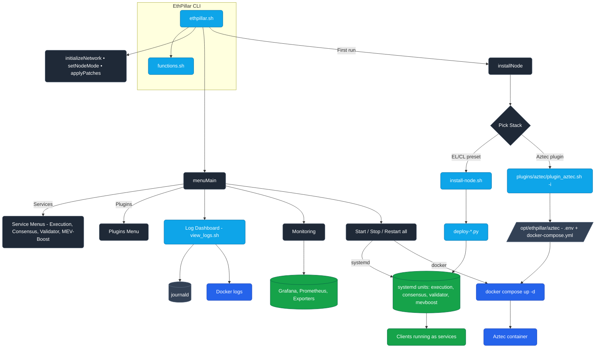
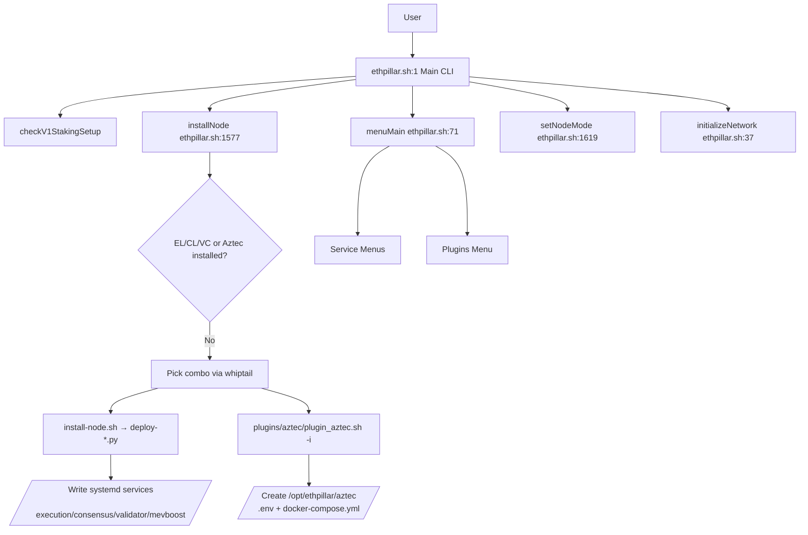
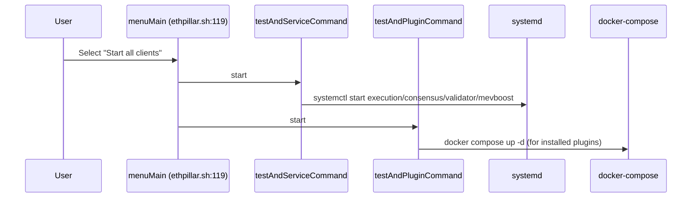
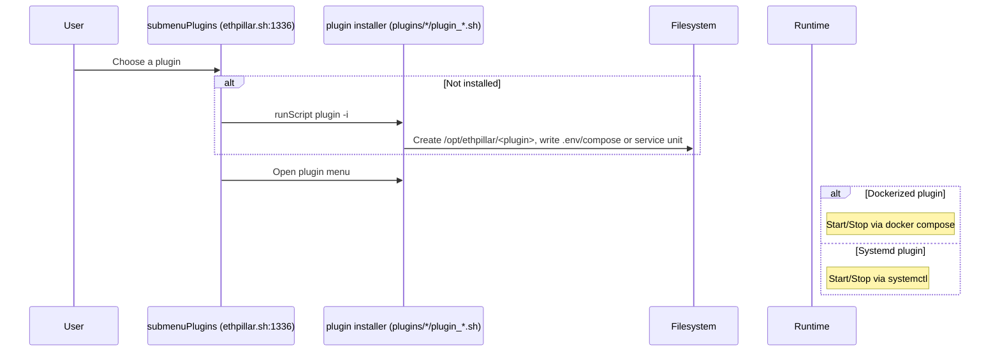
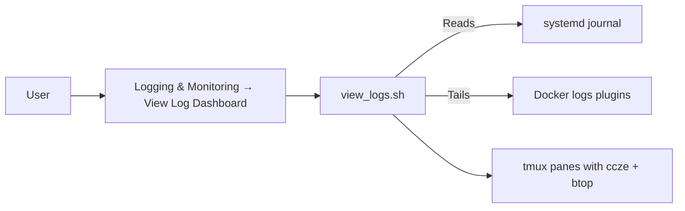

# EthPillar Architecture & Flow

This document explains what happens when you run `ethpillar`, how the app is structured, which files handle which responsibilities, and how they interact. It also includes pictorial diagrams of the end-to-end flows.

## High‑Level Overview

EthPillar is a terminal UI (TUI) for installing and managing Ethereum nodes, validators, and related plugins. It drives two kinds of runtimes:
- Systemd‑managed clients: Execution, Consensus, Validator, MEV‑Boost
- Docker‑managed plugins: e.g., Aztec Sequencer, Dora, Sentinel, etc.

Key entry points and responsibilities:
- `ethpillar.sh:1`: Main CLI/TUI. Orchestrates flows, menus, status, and integrations.
- `functions.sh:176`: Shared helpers (run scripts, network detection, UI helpers, status, exports).
- `install-node.sh:1`: Wrapper to install a node using a specific Python deployer.
- `deploy-*.py`: Python deployers that install selected EL/CL stacks and write systemd service files.
- `plugins/*`: Optional plugins (some are Dockerized, others add extra systemd services).

Paths used at runtime:
- `/etc/systemd/system/*.service`: Systemd service units for EL/CL/VC/MEV‑Boost and some plugins.
- `/opt/ethpillar/<plugin>`: Plugin install roots (env + docker-compose, data mounts).

---

## First Run Flow

What happens when you type `ethpillar` for the first time:

1) Main entry and environment load
- `ethpillar.sh:1` starts and sources helpers/env.
- `ethpillar.sh:1650` calls: `checkV1StakingSetup`, `setWhiptailColors`, `installNode`, `applyPatches`, `checkDiskSpace`, `checkCPULoad`, `setNodeMode`, `initializeNetwork`, then `menuMain()`.

2) Node installation workflow (if nothing installed)
- `installNode()` at `ethpillar.sh:1577` runs when no EL/CL/VC services and no Aztec are present.
- Displays a combo picker (EL/CL preset or Aztec). If you select a client combo:
  - `install-node.sh` is invoked with a matching deployer, e.g. `deploy-nimbus-nethermind.py`.
  - The deployer downloads binaries and writes systemd units:
    - Execution: `/etc/systemd/system/execution.service`
    - Consensus: `/etc/systemd/system/consensus.service`
    - Validator: `/etc/systemd/system/validator.service` (when selected)
    - MEV‑Boost: `/etc/systemd/system/mevboost.service` (when selected)
    - See examples around: `deploy-nimbus-nethermind.py:567`, `:709`, `:781`.

3) Main menu appears
- `menuMain()` at `ethpillar.sh:71` builds the menu dynamically based on installed services and plugins.
- Node mode banner and network endpoints are computed from `setNodeMode()` at `ethpillar.sh:1619` and `initializeNetwork()` at `ethpillar.sh:37`.

---

## Main Menu & Controls

The main TUI groups operations for services and plugins:

- “Start/Stop/Restart all clients”
  - Systemd services: `testAndServiceCommand()` → `sudo service ... start/stop/restart` (`ethpillar.sh:78`).
  - Plugins: `testAndPluginCommand()`
    - `start` → `docker compose up -d`
    - `stop`  → `docker compose stop`
    - `restart` → `docker compose restart`
    - See `ethpillar.sh:84`.

- Execution / Consensus / Validator / MEV‑Boost submenus
  - `ethpillar.sh:330`, `:396`, `:462`, `:566` handle service‑specific logs, start/stop/restart, resync/update.

- Plugins submenu
  - `submenuPlugins()` at `ethpillar.sh:1336` lists optional plugins and runs their installers/menus via `runScript()` (`functions.sh:176`).

- Logging & Monitoring
  - Log dashboard (tmux panes) is launched via `view_logs.sh` (`ethpillar.sh:238`).
  - “Rolling Consolidated Logs” tails systemd logs; includes Aztec docker logs when present (`ethpillar.sh:241`).
  - “Monitoring” manages Prometheus/Grafana/Exporter services (`ethpillar.sh:778`).

---

## Deployers and Services

When you install an EL/CL combo, `install-node.sh` executes a `deploy-*.py` script which:
- Downloads/installs clients (e.g., Nethermind, Nimbus, Lighthouse, Teku, Besu, Reth).
- Writes systemd unit files for EL/CL/VC/MEV‑Boost.
- Optionally prompts to start and enable autostart.

Systemd service examples (created by deployers):
- Execution: `/etc/systemd/system/execution.service` (see `deploy-nimbus-nethermind.py:567`)
- Consensus: `/etc/systemd/system/consensus.service` (see `deploy-nimbus-nethermind.py:709`)
- Validator: `/etc/systemd/system/validator.service` (see `deploy-nimbus-nethermind.py:781`)
- MEV‑Boost: `/etc/systemd/system/mevboost.service` (around `deploy-nimbus-nethermind.py:416`)

The TUI then controls these with `sudo service ...` start/stop/restart.

---

## Plugins Architecture

Plugins live under `plugins/` and are integrated through the main menu:
- `ethpillar.sh:110`: Adds plugin tiles when their install dirs exist (e.g., `/opt/ethpillar/aztec`).
- `ethpillar.sh:1336`: “Plugins” submenu handles install/open of each plugin’s own menu.
- `functions.sh:176`: `runScript()` runs plugin scripts.

Common plugin patterns:
- Dockerized plugin (e.g., Aztec, Dora, Sentinel):
  - Installer writes to `/opt/ethpillar/<plugin>` with `.env` and `docker-compose.yml`.
  - Start/Stop is via `docker compose ...` (from the plugin menu and main menu bulk actions).
- Systemd plugin (e.g., CSM Nimbus Validator):
  - Installer writes `/etc/systemd/system/csm_nimbusvalidator.service`.
  - Managed like other services from the main menu.

Examples:
- Aztec Sequencer
  - Installer: `plugins/aztec/plugin_aztec.sh:108`
  - Menu: `plugins/aztec/menu.sh:366`
  - Runtime definition: `plugins/aztec/docker-compose.yml.example:1`
  - Config template: `plugins/aztec/.env.example:1`

- Dora (lightweight explorer)
  - Installer: `plugins/dora/plugin_dora.sh:1`
  - Systemd unit example template: `plugins/dora/dora.service.example:1`

- Node Checker (security/health)
  - CLI: `plugins/node-checker/run.sh:801` (invoked via menus under Security & Node Checks).

- CSM Sentinel (Telegram alerts; docker)
  - Installer/menu: `plugins/sentinel/*`

- Client Stats / Contributoor / eth-validator-cli
  - Similar plugin scaffolds under `plugins/`.

---

## Logging, Monitoring, and Utilities

- Log dashboard (tmux panes): `view_logs.sh:1`. Adapts layout to your node mode and includes docker logs for plugins.
- Export logs to files (journald services): `export_logs()` at `functions.sh:1285`.
- Monitoring suite (Prometheus, Grafana, exporters): controlled from the Monitoring submenu (`ethpillar.sh:778`).
- Toolbox & Security menus: UFW, Fail2Ban, 2FA, swappiness, noatime, speed test, etc. (all wired via `runScript()` helpers in `functions.sh`).

---

## File Responsibilities Map

- `ethpillar.sh:1` — Main TUI: menus, orchestration, status banner, plugin integration.
- `functions.sh:1` — Shared utilities: environment, UI helpers, script runner (`runScript()` at `functions.sh:176`), network detection, status dialogs, exports, checks.
- `install-node.sh:1` — Wrapper around Python deployers; sets up Python env/tools, runs `deploy-*.py`.
- `deploy-*.py` — Client installers; write systemd unit files (execution/consensus/validator/mevboost), download binaries, prompt for start/enable.
- `view_logs.sh:1` — Tmux log board; shows EL/CL/VC and plugin logs in panes.
- `update_execution.sh:1`, `update_consensus.sh:1`, `resync_*` — Update/maintenance helpers for clients.
- `plugins/*` — Plugin installers and menus; write `/opt/ethpillar/<plugin>`, docker compose configs or systemd units.

---

## Pictorial Diagrams

### Unified Architecture Overview

### A) End‑to‑End First Run Flow

### B) Main Menu: Start/Stop/Restart All

### C) Plugin Install & Use (Generic)

### D) Log Dashboard

---

## Configuration and Data

- Env and constants loaded via:
  - `env` (project env), optional `./.env.overrides`, and plugin `.env` files.
- Systemd units and data locations used by deployers:
  - Execution (e.g., Nethermind): `/var/lib/<client>`, service user `execution`.
  - Consensus (e.g., Nimbus): `/var/lib/<client>`, service user `consensus`.
  - Validator (Nimbus VC): `/var/lib/<client>`, service user `validator`.
- Plugins under `/opt/ethpillar/<plugin>` mount their own data directories (e.g., Aztec binds `/opt/ethpillar/aztec/data`).

---

## How Things Fit Together (At a Glance)

- CLI skeleton: `ethpillar.sh` calls helper functions in `functions.sh` and delegates to deployers/plugins using `runScript()` (`functions.sh:176`).
- EL/CL/VC stacks: Installed by `install-node.sh` → `deploy-*.py`, managed by systemd, controlled via ethpillar menus.
- Plugins: Installed under `/opt/ethpillar`, dockerized or systemd‑based, controlled by their menus and by main menu bulk actions.
- Logs/Monitoring: `view_logs.sh` and Monitoring submenu manage logs and Grafana/Prometheus exporters.

If you want more diagrams (e.g., per‑client stacks or specific plugin lifecycles), let me know and I’ll add them.
